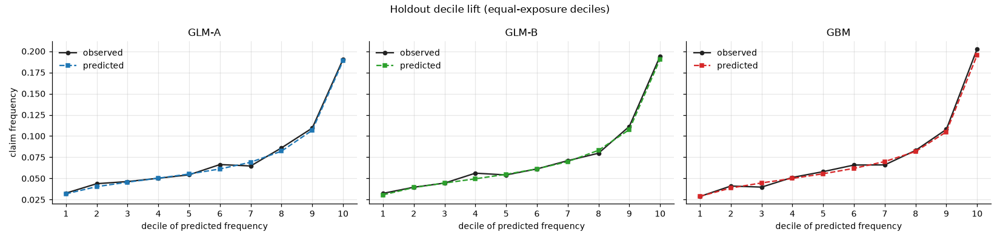
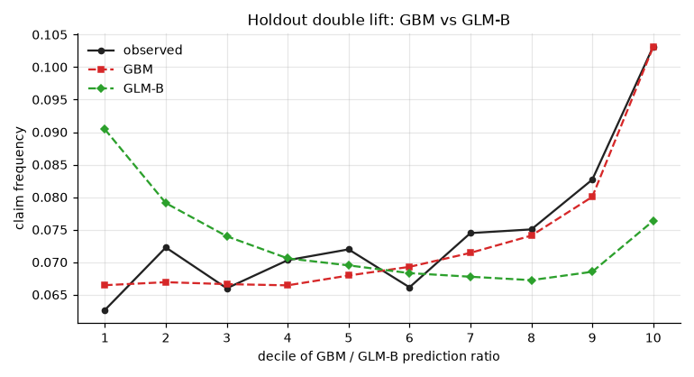

# fremtpl2-motor-pricing

Motor third-party liability pricing on the French MTPL data (freMTPL2, CASdatasets): frequency and severity GLMs, a GBM
benchmark, SHAP interactions used to improve the GLM, a multiplicative tariff and a dislocation analysis.

## Summary

On 677,991 policies (358,343 policy-years), a main-effects
Poisson GLM (GLM-A) reaches holdout Gini 0.294 against
0.316 for a LightGBM benchmark. SHAP interaction values, checked against raw
actual-versus-expected tables, gave three BonusMalus interactions; adding them (GLM-B) closes 41.1%
of the cross-validated deviance gap to the GBM (32.7% on holdout). Severity is a Gamma GLM on
claims capped at 20,000 plus a flat large-loss load.

## Key findings

- Claims history dominates: BonusMalus carries 63% of GLM-A's cross-validated gain.
- Three BonusMalus interactions recover 41.1% of the GBM's CV deviance advantage (32.7% holdout) for 1 net extra parameter.
- Exposure is not proportional (free coefficient 0.64); treating it as a control moves premium -8.5% at ages 18-20 and +10.5% at 75+.
- Fitted relativities mislead under interactions: ages 18-20 fitted 0.57, effective 3.31.

## Data and cleaning

| Item | Treatment | Ref. |
|---|---|---|
| Source | CASdatasets 1.2-1; claim counts reconcile with the claims file (unlike pre-2022 releases) | D001-D005 |
| Exposure | Capped at 1 year (1,224 policies); short exposures kept | D008 |
| Claim count | Capped at 4 for frequency (39 claims) | D009 |
| Large losses | Above 20,000: 170 learn claims; excess over the threshold is 25.1% of claim cost; load 0.336 | D010 |
| Split | 20% holdout + 5 CV folds, grouped by identical rating covariates | D011 |
| Factors | Bands of at least 2,000 policy-years; Area dropped (banded density) | D013-D016 |

Decisions and evidence: [DECISIONS.md](DECISIONS.md).

## Frequency results

| Model | Parameters | CV deviance, mean (sd) | Holdout deviance | Holdout Gini |
|---|---|---|---|---|
| Intercept only | 1 | 0.252058 (0.003117) | 0.255160 | 0.000 |
| GLM-A: main effects, banded | 72 | 0.239260 (0.003246) | 0.242651 | 0.294 |
| GLM-B: GLM-A + 3 BonusMalus interactions | 73 | 0.238611 (0.003004) | 0.242028 | 0.302 |
| GBM: LightGBM Poisson | 565 trees | 0.237682 (0.003109) | 0.240744 | 0.316 |

Deviance is the mean Poisson deviance per policy on claim counts (DECISIONS D019). CV uses 5 grouped folds of the learn set; the holdout (20%) was used only for final evaluation. The impact analysis uses GLM-A-mono as the current tariff: GLM-A with BonusMalus 61-80 merged so premium never falls as BonusMalus rises (69 parameters, CV 0.239374, holdout 0.242727; D041).

GLM-B parameters: the interactions add 4 and the BonusMalus constraint (merging 61-80) removes 3,
a net +1 against GLM-A.




## Interactions

The GBM's strongest interactions involve BonusMalus, led by driver age: a high bonus-malus coefficient means
inexperience for a young driver but recent claims for an older one. Accepted, one pair at a time (all 5 folds improve,
at least 5% of the gap, parsimony tie-break): a steeper BonusMalus effect for drivers under 30 plus a loading for drivers 55+ above the floor of 50; a flatter BonusMalus effect for brand B12; a flatter BonusMalus effect in a group of mainly urban and southern regions. Driver age x density and driver age x region
showed no pattern in the raw data and were rejected as GBM artefacts. The region x BonusMalus grouping is data-driven,
with no identified cause, and would need fairness and regulatory review before use. See
[reports/shap_interactions.md](reports/shap_interactions.md).

## Tariff

Base rate 108.56 per policy-year; severity varies only by a
three-level BonusMalus. Fitted driver-age relativities mislead on their own: young drivers' risk is carried by the
under-30 BonusMalus slope interaction (on top of the BonusMalus relativities), so the effective relativity (mean premium
relative to the base level, interactions included) is shown too.

| Driver age | Fitted (95% CI) | Effective |
|---|---|---|
| 18-20 | 0.57 (0.48-0.67) | 3.31 |
| 21-22 | 0.46 (0.39-0.54) | 2.37 |
| 23-24 | 0.43 (0.37-0.49) | 1.87 |
| 25-26 | 0.39 (0.34-0.45) | 1.44 |
| 27-29 | 0.38 (0.34-0.42) | 1.12 |
| 30-34 | 0.61 (0.58-0.64) | 0.96 |
| 35-44 | 0.81 (0.78-0.84) | 0.95 |
| 45-54 | 1.00 (1.00-1.00) | 1.00 |
| 55-64 | 0.80 (0.76-0.85) | 0.86 |
| 65-74 | 0.79 (0.74-0.84) | 0.76 |
| 75+ | 0.92 (0.85-0.99) | 0.86 |

| BonusMalus | Fitted (95% CI) | Effective |
|---|---|---|
| 50 | 1.00 (1.00-1.00) | 1.00 |
| 51-55 | 1.44 (1.34-1.55) | 1.39 |
| 56-60 | 1.91 (1.78-2.06) | 1.68 |
| 61-80 | 2.86 (2.69-3.05) | 2.28 |
| 81-90 | 3.16 (2.91-3.44) | 2.29 |
| 91-99 | 4.05 (3.68-4.47) | 3.00 |
| 100-110 | 6.93 (6.20-7.73) | 4.99 |
| 111+ | 10.80 (9.53-12.25) | 8.67 |

BonusMalus 61-80 is a single band under the BonusMalus constraint, so premium never falls as BonusMalus rises (D039); the original claim-frequency
spike at 61-65 that required this is unexplained by the available data.

**Main trade-off of a GLM tariff.** Against a GBM-based premium on the holdout (correlation 0.94), observed
loss cost is 1.27x the tariff premium in the decile where the tariff is cheapest relative to
the GBM (0.94x the GBM's) and 0.65x in the dearest
(0.88x). Transparency costs these tails. See [reports/tariff.md](reports/tariff.md).

## Impact

| Step (revenue neutral) | Exposure moving > 5% | Mean absolute change |
|---|---|---|
| 1. GLM-A -> GLM-A-mono (BonusMalus constraint) | 8.5% | 1.7% |
| 2. GLM-A-mono -> GLM-B (interactions) | 65.3% | 9.6% |
| total: GLM-A -> GLM-B | 67.7% | 10.1% |

The interactions, not the BonusMalus constraint, drive the movement. On the holdout the proposed premium is closer to observed
loss cost in 6 of 7 change bands but overshoots the largest increases; a rebalanced +/-15% cap delivers
78.6% of the movement in year one. See
[reports/impact_analysis.md](reports/impact_analysis.md).

## Limitations

- No dates: no trending, inflation or development; claims treated as fully developed.
- Exposure is not proportional (free coefficient 0.64); treating it as a control would move
  premium -8.5% at ages 18-20 and +10.5% at 75+.
- Holdout actual over modelled burning cost is 1.30, or
  0.94 without its largest claim.
- Burning cost only; no demand, competitor or fairness analysis.
- French TPL with a statutory bonus-malus scale; the methods transfer to UK motor, the parameters do not.

**BonusMalus.** It carries 63% of GLM-A's cross-validated gain and is itself a record of past claims (endogeneity). Claim frequency is associated with the BonusMalus coefficient to the power 2.07 (95% CI 2.01-2.14), but BonusMalus is entangled with driving experience: 6.1% of exposure at ages 18-20 is at the floor of 50 against 80% at 45-54. Full note in [LIMITATIONS.md](LIMITATIONS.md).

## Reproduce

```
git clone <this repository> && cd <repository>
pip install -r requirements.txt
make all
```

`make all` downloads the data, runs every stage and the tests; per-stage runtimes are written to `reports/tables/pipeline_runtime.csv`.

## Sources and credits

- C. Dutang and A. Charpentier, *CASdatasets*, R package (freMTPL2freq, freMTPL2sev).
- A. Noll, R. Salzmann and M. V. Wüthrich (2020), *Case study: French motor third-party liability claims*, SSRN 3164764.
- GLMs, LightGBM, SHAP (Lundberg et al.) and Friedman's H-statistic are standard methods, used as published.

Prathmesh Shah, GI Pricing Actuary
